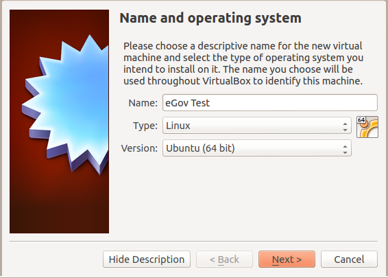
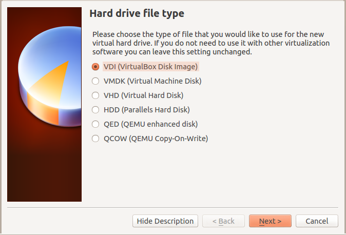
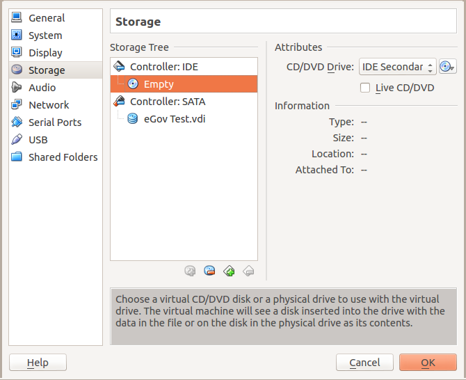

# Creating a virtual machine
Follow the normal procedure, as described in the VirtualBox manual, on how to create a new virtual machine. 

## Creating a VirtualBox machine with Ubuntu 12.10 

Below we provide settings for creating a Virtualbox machine for Ubuntu 12.10. You can choose to use our settings or change some at your will.

Note: If you’re on a Ubuntu system you might have to add your user to the vboxusers group.

### Name and operating system

* Name:	    eGov testing machine
* Type:	    Linux
* Version:  Ubuntu (64 bit)

### Memory size

* 2048 MB

### Hard drive

* Choose to create a virtual hard drive now

### Hard drive file type

* Choose VDI 

### Storage on physical hard drive

* Choose Dynamically allocated

### File location and size

* 8 GB should be enough

Your disk has now been created. Before starting it we need to do some additional settings.

### Network

#### Setup the network card

* Open up the VirtualBox Manager
* Choose your Virtual machine and click Settings
* Make sure Network Adapter 1 is enabled. 

The following settings should be applied to Adapter 1.

**Attached to**:  NAT (previously Bridged adaptor was advised)

* **Name**:       eth0
* **Advanced**:     
* **Adapter type**:		Intel PRO/1000 MT Desktop (...)
* **Promiscuous mode**: 	Deny
* **MAC Address**:		use the suggested
* **Cable connected**:		should be checked

*This gives your virtual machine an IP address on the same subnet as
 the host computer. See http://www.virtualbox.org/manual/ Chapter 6
 for additional information on bridged networking.*

##### Allowing SSH logins to your virtual machine

Open up the VirtualBox Manager

Choose your Virtual machine and click Settings

Choose Port forwarding

Add a new rule by clicking the + sign. Enter

* **Rule**: ssh
* **Protocol**: TCP
* **Host IP**:
* **Host Port**: 2256   (the value can basically be any free port on your host computer)
* **Guest IP**:
* **Guest Port**: 22

#### USB
Make sure USB is enabled if you plan to use a smart card reader or another USB device 

To use a smart card reader in your virtual machine you have to do the following:

* Attach the smart card reader to your computer
* Add Filter from Device (Alt + Ins) and choose the device that is attached to the physical machine. 
* The same procedure applies to other peripherals, like a USB storage device.

See http://www.virtualbox.org/manual/ Chapter 3 for additional information

### Installing Ubuntu

Download the preferred Ubuntu iso image from ubuntu.com

Click Settings and choose storage. 

Add the downloaded iso image to the virtual machine as a CD-ROM by clicking the Empty icon (image missing) under Controller: IDE and then click on the disc icon right of the text CD/DVD Drive: . 

Choose a virtual CD/DVD disk file ... and point out the downloaded iso image (e.g. ubuntu-12.10-desktop-amd64.iso).

Click Start

Follow the installation instructions to install Ubuntu in your new virtual machine.

#### Upgrading your installation

To upgrade your system you need to:

* Click on the Software updater icon to your left
* Click install now
* Enter password

#### Installing necessary tools in your virtual machine

The following tools need to be installed on your virtual machine

* openssh-server

Install them by typing the following command in a terminal window,
assuming you’re logged in as your first user (created during the
Ubuntu installation):

sudo apt-get install openssh-server

#### Setting up users on the virtual machine

Log in to your virtual machine as the user you created during installation.

##### Setting up the root account

* Permit root to login via the ssh server.
* Launch a terminal window 
* Open up the ssh server configuration file

`sudo gedit /etc/ssh/sshd_config` 

* Make sure that PermitRootLogin is set to yes
* Restart the ssh server

`sudo /etc/init.d/ssh restart ` 

* Add the ssh key of your host user to the root account

TODO: what IP does the client/guest get??

##### Setting up a new user

VMM puts no restrictions or requirements on the name of the user in your virtual machine. The user name “egov-tester” is given here as an example and will be used in all manual text below.

Log in as the user you created during the Ubuntu installation.

Open up a user management tool by pressing the dasher (logo missing) and type user accounts. 

* Press the unlock symbol and type in the password of the first user you created. 

* Press the + symbol. You will now see a new window, called Create new account, in which you should fill in:

**Account Type**:	      Standard
**Full name**:		E-goc tester
**Username**		      egov

* Click on Enable password and type in a password.

